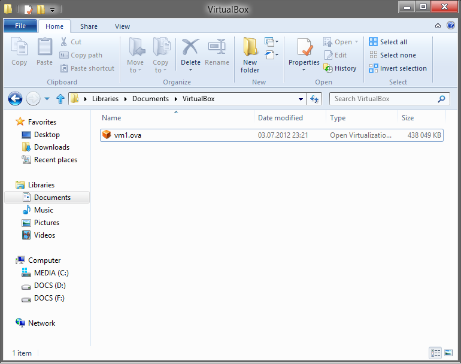
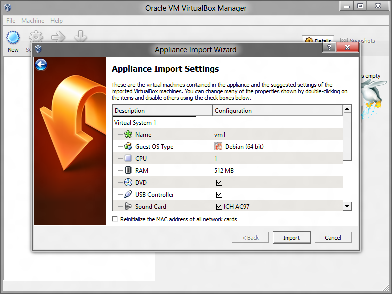
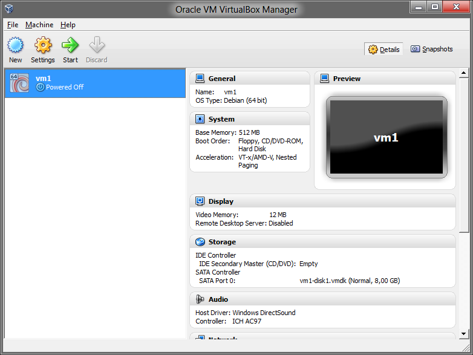
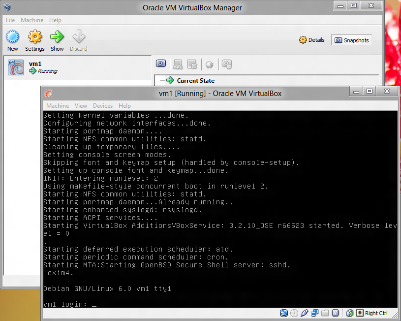
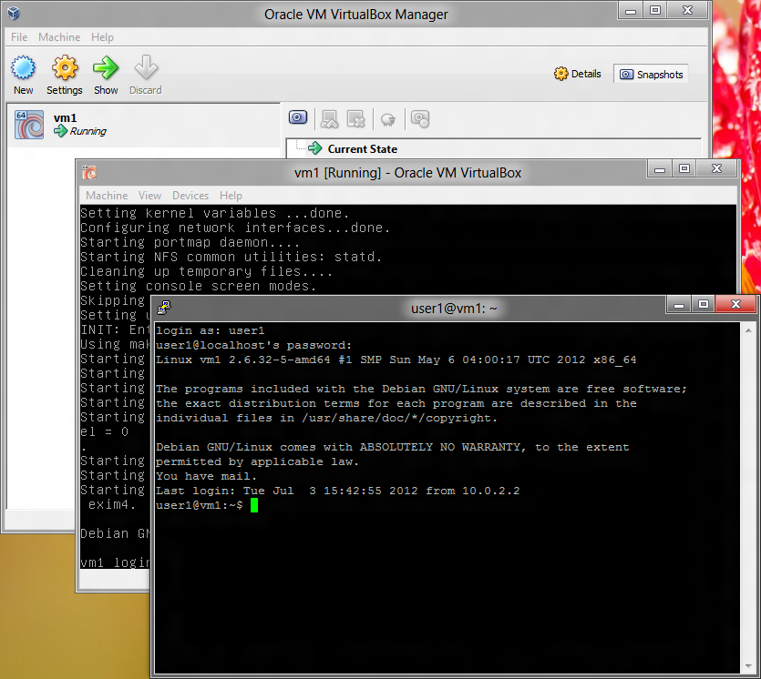

# 练习 0：起步

## Windows，手动安装

[非常长的指南](https://archive.fo/p1ZHn)

## Windows，VirtualBox 虚拟机（`.ova`格式的预配置映像）

### 你需要什么

+   VitualBox，虚拟机播放器。
+   putty，终端模拟器。
+   预配置的 VirtualBox Debian 映像。

## 这样做

+   下载并安装 [VirtualBox](http://download.virtualbox.org/virtualbox/4.1.18/VirtualBox-4.1.18-78361-Win.exe)

+   下载并安装 [Putty](http://the.earth.li/~sgtatham/putty/latest/x86/putty-0.62-installer.exe)。

+   下载此文件：<https://docs.google.com/open?id=0Bw1iG1X4Li39ZlhkQmgtM1BhV2s>

    另一个链接：<http://thepiratebay.se/search/vm1.ova/0/99/0>

    或另一个链接：<http://www.fileconvoy.com/dfl.php?id=g280b501145101ce4999185763996254d441643a34>
    
    ```
    md5: 7ac8a6059460f7f3e39aee7c4ee2c230 
    sha256: 18d8f31d0894c89865d5306b0cb3284d8889e15d155c7435fc7888f3dbafa3ec
    ```
    
+   打开文件

    
    
+   点击`Import`

    

+   选择`vm1`并点击`Start`

    

+   等待`vm1`启动

    

+   启动`putty`，在`Host Name`或者`IP Address`中输入`localhost`。之后点击`Open`

    

+   输入`user1`, `<ENTER>`, `123qwe`, `<ENTER>`。

    
    
+   恭喜，你现在登入了`vm1`。

    
    
## Linux

你已经使用 Linux 了，你还需要什么嘛？开个玩笑。你可以严格遵循我的指南，或者随意在你的系统上做实验。

## Mac OS

以后我会在这里把步骤补上。

