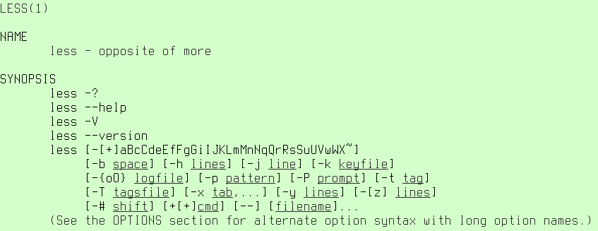

# 练习 12：文档：`man`，`info`

> 原文：[Exercise 12. Documentation: man, info](https://archive.fo/6fbXi)

> 译者：[飞龙](https://github.com/wizardforcel)

> 协议：[CC BY-NC-SA 4.0](http://creativecommons.org/licenses/by-nc-sa/4.0/)

> 自豪地采用[谷歌翻译](https://translate.google.cn/)

既然你已经尝试过了 Linux，现在是时候介绍 Linux 在线文档工具了。你已经知道`man`了，因为我让你在里面查找东西。也许你甚至阅读了`man`的文档页面。所以无论如何，你需要什么来了解`man`，以便有效地使用它？

首先，手册页只是包含特殊标记的压缩文本文件，所以`man`程序知道如何为你设置格式。在 Debian 中，它们位于`/usr/share/man/`中。你可以使用`zless`浏览它们 。它甚至不是一个程序，而是一个 shell 脚本，它解压缩文件并调用`less`。

接下来，我将引用`man`手册页，关于它的分类：

1.  可执行程序或 shell 命令
2.  系统调用（内核提供的函数）
3.  库调用（程序库中的函数）
4.  特殊文件（通常在`/dev`中找到）
5.  文件格式和约定，例如`/etc/passwd`
6.  游戏
7.  其他（包括宏及惯例），例如`man(7)`，`groff(7)`
8.  系统管理命令（通常仅适用于 root 用户）
9.  内核例程[非标准]

这正是字面的意思。为了调用`man`的适当分类，请键入其分类编号，如`man 1`。如果你不明白某些分类是什么意思，则不用担心，现在你只需要第 1 个和第 8 个 ，这些分类是系统上安装的程序和系统管理员工作。此外，你已经知道`man(7)`是什么。

这是手册页的标准小节：

+   NAME（名称） - 程序名称和简短描述。
+   SYNOPSIS（概要） - 可用程序选项的简短列表
+   DESCRIPTION（描述） - 程序的描述和可用参数的说明。
+   OPTIONS（选项） - 一些手册页在这里继续说明可用的参数。
+   EXIT STATUS（退出状态） - 每个程序返回一个代表其成功或失败的代码。这里解释这些代码值。
+   RETURN VALUE（返回值） - 通常与退出状态相同。
+   ERRORS（错误） - 程序中已知的错误。
+   ENVIRONMENT（环境） - 环境变量。在调用程序之前设置它们。
+   FILES（文件） - 通常是程序配置文件。
+   VERSIONS（版本） - 有关程序更改的信息。
+   CONFORMING TO（适用于） - 兼容性说明。
+   NOTES（注意） - 手册的作者不知道放在哪里的信息。
+   BUGS - 程序中已知的错误。
+   EXAMPLE（示例） - 包含程序调用的示例。很有用！
+   AUTHORS（作者） - 谁写的程序。
+   SEE ALSO（另见）- 相关手册页。

现在是惯例，再次引用：

+   **粗体文本** - 类型完全如图所示。
+   *斜体文本* - 用适当的参数替换。这个文字大部分显示不是斜体，而是像下划线一样 。
+   `[-abc]` - `[]`内的任何或所有参数是可选的。
+   `-a|-b` - 由`|`分隔的选项不能一起使用
+   `argument …` - 参数是可重复的。
+   `[expression] …` - `[]`中的整个表达式是可重复的。

我会通过示例来演示它。`man less`会展示：

好吧，看起来有些恐怖。前四行很简单，只需要键入展示的东西，就是这样：

1\. `less -?`
2\. `less –help`
3\. `less -V`
4\. `less –version`

从第 5 行开始，我们可以看到，斜体 文本确实显示为下划线。而且，看起来完全不可理解。让我们一起看看。

5\. `less [-[+]aBcCdeEfFgGiIJKLmMnNqQrRsSuUVwWX~]` - 这看起来更可怕。

首先，它是可选的，因为所有参数都包含在`[]`中。
其次，当指定参数时，必须以`-`开头。这是非可选的。
第三，之后，你可以指定可选修饰符`+`，这在手册中进一步说明。
第四，你可以指定一个或几个命令，在这里显示为字母序列。例如，你可以输入`less -S .bashrc`，或`less -+S .bashrc`或`less -SG .bashrc .profile`或更少`less -+SG .bashrc .profile`。

6\. `[-b space] [-h lines] [-j line] [-k keyfile]` - 简单的说，你可以指定任何选项`-b`，`-h`，`-j`，`-k`，分别带有参数空格，多个行，单个行和密钥文件，它们在手册中进一步介绍。

7\. `[-{oO} logfile] [-p pattern] [-P prompt] [-t tag]` - 几乎和第六行相同。`-{oO}`的意思是，你可以指定`-o`或`-O`，但不能同时指定二者。

8\. `[-T tagsfile] [-x tab,…] [-y lines] [-[z] lines]` - 同样，几乎和第六行相同。`-x tab,…`的意思是，，你可以在`-x`之后指定几个值，例如`-x9`或`-x9,17`。`-[z] lines`表示，`-z`是可选的，你可以输入`less -10`来代替`less -z10`。

9\. `[-# shift] [+[+]cmd] [- -] [filename]…` - 这有点更加神秘。`+[+]cmd`表示你可以输入`less +cmd`或`less ++ cmd`。`- -`只是一个前缀。`[filename]…`读取一个或多个，意思是你可以在调用`less`时指定多个文件，例如`less .bashrc`，`less .bashrc .profile`，以及其他。

我们结束了！不是那么可怕，是吗？记住，由于你正在使用`less`查看手册，为了搜索某些选项的含义，键入`/key<ENTER>`或`&key<ENTER>`。例如，要搜索`-T`选项的意思，请键入`/-T<ENTER>`。

现在我将向你提供实用的`man`命令的列表：

+   `man -k` - 列出系统中的所有手册页。不是非常有用，但你可能希望看到此列表。或者你可以通过键入`man -k | wc`来计数它们。
+   `man -k [search string]` - 在搜索手册页描述中搜索内容。试试这个：`man -k tty`。
+   `man -wK [search string]` - 在手册页正文中搜索内容。试试这个：`man -wK tty`。

那么这是用于`man`的。现在，还有一个有用的文档工具，`info`。命令列表如下：

+   `info […]` - 调用`info`。如果你不使用参数调用它，它会将你带到索引页面。
+   `<UP>`， `<DOWN>`， `<LEFT>`， `<RIGHT>`可让你滚动文字。
+   `<ENTER>`打开光标下的链接。链接以`*`开头。
+   `<TAB>` - 跳转到文档中的下一个链接。
+   `u` - 转到上一级
+   `p` - 转到上一页，就像浏览器一样。
+   `n` - 转到下一页。
+   `q` - 关闭`info`。

为了使用`vi`选项来启动`info`，我希望你已经熟悉它了，键入`info -vi-keys`。现在你可以使用`j`和`k`来滚动。

## 附加题

+   键入`man man`并尝试解码 SYNOPSIS（概要）部分，这将解释如何调用它。
+   键入`info`和`h`，阅读`info`的帮助部分。
