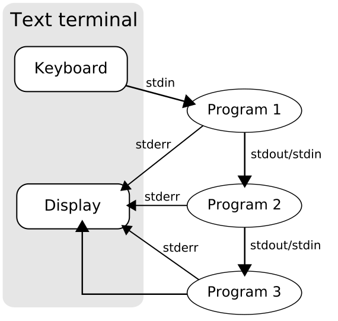

# 练习 8：更多的重定向和过滤：`head`，`tail`，`awk`，`grep`，`sed`

> 原文：[Exercise 8. Bash: more on redirection and filtering: head, tail, awk, grep, sed](https://archive.fo/JH46V)

> 译者：[飞龙](https://github.com/wizardforcel)

> 协议：[CC BY-NC-SA 4.0](http://creativecommons.org/licenses/by-nc-sa/4.0/)

> 自豪地采用[谷歌翻译](https://translate.google.cn/)

现在你试过了 Linux，我会介绍一下 Unix 的方式。注意看。

> 这就是 Unix 的哲学：写一些程序，只做一件事，并且把它做好。编写程序，使其一起工作。编写程序来处理文本流，因为这是一个通用接口。

实际上这意味着为了熟练使用 Linux，你需要知道如何从一个程序中获取输出，并将其提供给另一个程序，通常会在此过程中修改它。通常，你可以通过使用管道，将多个程序合并在一起，它允许将一个程序的输出连接到另一个程序。像这样：



这里发生的事情真的很简单。几乎每个 Linux 程序在启动时打开这三个文件：

`stdin` - 标准输入。这是程序读取东西的地方。
`stdout` - 标准输出。这是程序写出东西的地方。
`stderr` - 标准错误。这是程序报错的地方。

这就是它的读取方式：

```
启动程序 1 
    开始从键盘读取数据
    开始向显示器写出错误
    启动程序 2 
        开始从程序 1 读取输入
        开始向显示器写出错误
        启动程序 3 
            开始从程序 2 读取输入
            开始向显示器写出错误
            开始向显示器写出数据
```

还有另一种方式来描绘发生的事情，如果你喜欢 South Park 风格的幽默，但要小心：看到的是不会是不可见的！[警告！你无法忽略它](http://osxdaily.com/wp-content/uploads/2011/04/south-park-human-centipad.jpg)。

让我们考虑以下管道，它接受`ls -al`的输出，仅打印文件名和文件修改时间：

```
ls -al | tr -s ' ' | cut -d ' ' -f 8,9
```

这是所发生事情的概述：

```
启动 ls -al
    获取当前目录中的文件列表
    向显示器写出错误
    向管道写出输出
    启动 tr -s ' '
        通过管道从 ls -al 读取输入
        两个字段之间只保留一个空格
        向显示器写出错误
        向管道写出输出
        启动 cut -d ' ' -f 8,9
            通过管道从 tr -s ' ' 读取输入
            只保留字段 8 和 9，扔掉其它东西
            向显示器写出错误
            向显示器写出输出
```

更详细地说，这是每一步发生的事情：

第一步：`ls -al`，我们获取了目录列表，每一列都叫做字段。

```
user1@vm1:~$ ls -al
total 52
drwxr-xr-x 2 user1 user1 4096 Jun 18 14:16 .
drwxr-xr-x 3 root  root  4096 Jun  6 21:49 ..
-rw------- 1 user1 user1 4865 Jun 15 19:34 .bash_history
-rw-r--r-- 1 user1 user1  220 Jun  6 21:48 .bash_logout
-rw-r--r-- 1 user1 user1 3184 Jun 14 12:24 .bashrc
-rw-r--r-- 1 user1 user1   64 Jun 18 14:16 hello.txt
-rw------- 1 user1 user1   89 Jun 18 16:26 .lesshst
-rw-r--r-- 1 user1 user1  634 Jun 15 20:03 ls.out
-rw-r--r-- 1 user1 user1  697 Jun  7 12:25 .profile
-rw-r--r-- 1 user1 user1  741 Jun  7 12:19 .profile.bak
-rw-r--r-- 1 user1 user1  741 Jun  7 13:12 .profile.bak1
-rw------- 1 user1 user1  666 Jun 18 14:16 .viminfo
```

第二步：`ls -al | tr -s ' '`，我们在两个字段之间只保留，因为`cut`不能将多个空格理解为一种方式，来分离多个字段。

```
user1@vm1:~$ ls -al | tr -s ' '
total 52
drwxr-xr-x 2 user1 user1 4096 Jun 18 14:16 .
drwxr-xr-x 3 root root 4096 Jun 6 21:49 ..
-rw------- 1 user1 user1 4865 Jun 15 19:34 .bash_history
-rw-r--r-- 1 user1 user1 220 Jun 6 21:48 .bash_logout
-rw-r--r-- 1 user1 user1 3184 Jun 14 12:24 .bashrc
-rw-r--r-- 1 user1 user1 64 Jun 18 14:16 hello.txt
-rw------- 1 user1 user1 89 Jun 18 16:26 .lesshst
-rw-r--r-- 1 user1 user1 634 Jun 15 20:03 ls.out
-rw-r--r-- 1 user1 user1 697 Jun 7 12:25 .profile
-rw-r--r-- 1 user1 user1 741 Jun 7 12:19 .profile.bak
-rw-r--r-- 1 user1 user1 741 Jun 7 13:12 .profile.bak1
-rw------- 1 user1 user1 666 Jun 18 14:16 .viminfo
```

第三步：我们只保留字段 8 和 9，它们是我们想要的。

```
user1@vm1:~$ ls -al | tr -s ' ' | cut -d ' ' -f 8,9
 
14:16 .
21:49 ..
19:34 .bash_history
21:48 .bash_logout
12:24 .bashrc
14:16 hello.txt
16:26 .lesshst
20:03 ls.out
12:25 .profile
12:19 .profile.bak
13:12 .profile.bak1
14:16 .viminfo
```

现在你学到了，如何从一个程序获取输入，并将其传给另一个程序，并且如何转换它。

## 这样做

```
 1: ls -al | head -n 5
 2: ls -al | tail -n 5
 3: ls -al | awk '{print $8, $9}'
 4: ls -al | awk '{print $9, $8}'
 5: ls -al | awk '{printf "%-20.20s %s\n",$9, $8}'
 6: ls -al | grep bash
 7: ls -al > ls.out
 8: cat ls.out
 9: cat ls.out | sed  's/bash/I replace this!!!/g'
```

### 你会看到什么

```
user1@vm1:~$ ls -al | head -n 5
total 52
drwxr-xr-x 2 user1 user1 4096 Jun 18 14:16 .
drwxr-xr-x 3 root  root  4096 Jun  6 21:49 ..
-rw------- 1 user1 user1 4865 Jun 15 19:34 .bash_history
-rw-r--r-- 1 user1 user1  220 Jun  6 21:48 .bash_logout
user1@vm1:~$ ls -al | tail -n 5
-rw-r--r-- 1 user1 user1  636 Jun 18 17:52 ls.out
-rw-r--r-- 1 user1 user1  697 Jun  7 12:25 .profile
-rw-r--r-- 1 user1 user1  741 Jun  7 12:19 .profile.bak
-rw-r--r-- 1 user1 user1  741 Jun  7 13:12 .profile.bak1
-rw------- 1 user1 user1  666 Jun 18 14:16 .viminfo
user1@vm1:~$ ls -al | awk '{print $8, $9}'
 
14:16 .
21:49 ..
19:34 .bash_history
21:48 .bash_logout
12:24 .bashrc
14:16 hello.txt
16:26 .lesshst
17:52 ls.out
12:25 .profile
12:19 .profile.bak
13:12 .profile.bak1
14:16 .viminfo
user1@vm1:~$ ls -al | awk '{print $9, $8}'
 
. 14:16
.. 21:49
.bash_history 19:34
.bash_logout 21:48
.bashrc 12:24
hello.txt 14:16
.lesshst 16:26
ls.out 17:52
.profile 12:25
.profile.bak 12:19
.profile.bak1 13:12
.viminfo 14:16
 
user1@vm1:~$ ls -al | awk '{printf "%-20.20s %s\n",$9, $8}'
 
.                    14:16
..                   21:49
.bash_history        19:34
.bash_logout         21:48
.bashrc              12:24
hello.txt            14:16
.lesshst             16:26
ls.out               17:52
.profile             12:25
.profile.bak         12:19
.profile.bak1        13:12
.viminfo             14:16
user1@vm1:~$ ls -al | grep bash
-rw------- 1 user1 user1 4865 Jun 15 19:34 .bash_history
-rw-r--r-- 1 user1 user1  220 Jun  6 21:48 .bash_logout
-rw-r--r-- 1 user1 user1 3184 Jun 14 12:24 .bashrc
user1@vm1:~$ ls -al > ls.out
user1@vm1:~$ cat ls.out
total 48
drwxr-xr-x 2 user1 user1 4096 Jun 18 14:16 .
drwxr-xr-x 3 root  root  4096 Jun  6 21:49 ..
-rw------- 1 user1 user1 4865 Jun 15 19:34 .bash_history
-rw-r--r-- 1 user1 user1  220 Jun  6 21:48 .bash_logout
-rw-r--r-- 1 user1 user1 3184 Jun 14 12:24 .bashrc
-rw-r--r-- 1 user1 user1   64 Jun 18 14:16 hello.txt
-rw------- 1 user1 user1   89 Jun 18 16:26 .lesshst
-rw-r--r-- 1 user1 user1    0 Jun 18 17:53 ls.out
-rw-r--r-- 1 user1 user1  697 Jun  7 12:25 .profile
-rw-r--r-- 1 user1 user1  741 Jun  7 12:19 .profile.bak
-rw-r--r-- 1 user1 user1  741 Jun  7 13:12 .profile.bak1
-rw------- 1 user1 user1  666 Jun 18 14:16 .viminfo
user1@vm1:~$ cat ls.out | sed  's/bash/I replace this!!!/g'
total 48
drwxr-xr-x 2 user1 user1 4096 Jun 18 14:16 .
drwxr-xr-x 3 root  root  4096 Jun  6 21:49 ..
-rw------- 1 user1 user1 4865 Jun 15 19:34 .I replace this!!!_history
-rw-r--r-- 1 user1 user1  220 Jun  6 21:48 .I replace this!!!_logout
-rw-r--r-- 1 user1 user1 3184 Jun 14 12:24 .I replace this!!!rc
-rw-r--r-- 1 user1 user1   64 Jun 18 14:16 hello.txt
-rw------- 1 user1 user1   89 Jun 18 16:26 .lesshst
-rw-r--r-- 1 user1 user1    0 Jun 18 17:53 ls.out
-rw-r--r-- 1 user1 user1  697 Jun  7 12:25 .profile
-rw-r--r-- 1 user1 user1  741 Jun  7 12:19 .profile.bak
-rw-r--r-- 1 user1 user1  741 Jun  7 13:12 .profile.bak1
-rw------- 1 user1 user1  666 Jun 18 14:16 .viminfo
```

## 解释

+   只打印目录列表中的前 5 个条目。
+   只打印目录列表中的后 5 个条目。
+   只打印修改时间和文件名。注意我如何使用`awk`，这比`cut`更聪明。这里的区别就是，`cut`只能将单个符号（我们这里是空格）理解为一种方式，来分离字段（字段分隔符），`awk`将任意数量的空格和 TAB 看做文件分隔符，所以没有必要使用`tr`来消除不必要的空格。
+   按此顺序打印文件名和修改时间。这又是`cat`不能做的事情。
+   工整地打印文件名和修改时间。注意现在输出如何变得更清晰。
+   仅打印目录列表中包含`bash`的行。
+   将目录列表的输出写入文件`ls.out`。
+   打印出`ls.out`。`cat`是最简单的可用程序，允许你打印出一个文件，没有更多了。尽管如此简单，但在构建复杂管道时非常有用。
+   打印出`ls.out`，将所有的`bash`条目替换为`I replace this!!!`。`sed`是一个强大的流编辑器，它非常非常非常有用。

## 附加题

+   打开`head`，`tail`，`awk`， `grep`和`sed`的手册页。不要害怕，只要记住手册页面总是在那里。有了一些实践，你将能够实际了解他们。
+   查找`grep`选项，能够打印它找到的那行之前，或之后的一行。
+   使用 Google 搜索`awk printf`命令，尝试了解它如何工作。
+   阅读 [The Useless Use of Cat Award](https://archive.fo/9Zcyu)。尝试那里的一些例子。

