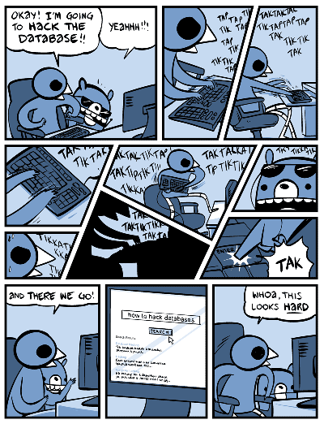

# 引言

> 原文：[Introduction](https://archive.fo/xDb8o)

> 译者：[飞龙](https://github.com/wizardforcel)

> 协议：[CC BY-NC-SA 4.0](http://creativecommons.org/licenses/by-nc-sa/4.0/)

> 自豪地采用[谷歌翻译](https://translate.google.cn/)

深入兔子洞吧，这就是 Linux：

<https://bellard.org/jslinux/vm.html?url=https://bellard.org/jslinux/buildroot-x86.cfg>

向它说声“你好”，点击链接并且键入`hello`，之后按下`<ENTER>`。

## 简介

这是一个简单的指南，以“笨办法学 X”的风格编写，但作者不是 Zed A. Shaw。它的目的是给你一些使用类 Unix 系统的经验。有许多很好的类似 UNIX 系统，例如 FreeBSD，OpenBSD，OpenSolaris 甚至 MAC OS X，仅举几例。我在本指南中决定使用哪个系统时，我选择了 Linux，主要是因为它是最受欢迎的类 UNIX 服务器操作系统，这意味着与其他 UNIX 衍生产品相比，在外面遇到的机会更大。而且 Linux 相关的技能更容易迁移到其他类 UNIX 系统。

现在我想告诉你一些细节。您将遇到许多详细的表格，包含许多字段的列表。你可能认为你不需要大部分的信息，但是我想在这里做的就是，教你正确的方法，来处理所有这些可怕的数据。这种正确的方法是将这些数据解释为数学公式，其中每个符号都有其含义。

如果你已经有了 Linux 的经验，你可能会知道很多命令，但是你知道这些命令输出的每一个字段嘛？我们以`ls`为例，只列出当前目录中的所有文件。

```
user1@vm1:~$ ls -al
total 32
drwxr-xr-x 2 user1 user1 4096 Jul 20 08:33 .
drwxr-xr-x 4 root  root  4096 Jul  2 06:19 ..
-rw------- 1 user1 user1 4092 Jul 20 11:02 .bash_history
-rw-r--r-- 1 user1 user1  220 Jul  2 06:19 .bash_logout
-rw-r--r-- 1 user1 user1 3184 Jul  2 06:19 .bashrc
-rw------- 1 user1 user1  295 Jul  2 11:34 .lesshst
-rw-r--r-- 1 user1 user1  675 Jul  2 06:19 .profile
-rw------- 1 user1 user1 1222 Jul 20 08:33 .viminfo
```

你知道这里每个东西的意思吗？最顶上的`total`，`drwxr-xr-x`中的`d`，第二列中的数字，第三列中的数字，日期的含义，这些点`.`和`..`的含义，以及它们储存在哪里？

或者你只是耸耸肩，认为一些事情是 OK 的，这是文件的列表，这就是我现在需要的所有东西，这些额外字段不重要嘛？我想我知道，这个日期只是修改日期，`.`和`..`只是当前目录和上级目录的同义词。但是我不需要其它数据，我的大脑已经塞满了。 如果你想做的只是上网冲浪，这个方法没问题，但是如果你想了解 你的系统，这个方法是不行的。最重要的是，UNIX 是非常合乎逻辑的，通过让你了解有什么数据，你还将了解系统如何工作，所有关于程序运行，存储和数据访问以及互联网链接的细节。

底线是，精通你的领域。注意细节。了解屏幕上的每一个数据都有其意义，并且出于某种原因，被称为字段 ，不要忽视某些东西，因为发现它所做的事情是很难的。但不要走向另一个极端，那么你就变得痴迷于所有这些细节，就无法看到大局。如果一些东西现在没有任何意义，并且你已经花了大量的时间来研究它，有时最好把它写下来，再回到这个地方，或者问一个知道它的人，但是首先自己试着去了解它的功能。也许，如果你现在还在学习一些东西，你会明白，困难的部分也会变得容易很多。

为了总结我的观点，关于细节的关注和精通你的领域，我将在这里插入一张图片：

> 精通你的领域，不要 · 像 · 这样：



© [Nedroid](http://nedroid.com/2012/05/honk-the-databus/)

和这个指南的目的有一些关系。这是成败完全靠自己的东西，其主要目的是熟悉 Linux 环境和大量的概念和命令。其实不仅仅是熟悉，而是要记住！是的，你需要记住这些东西。是的，这意味着你必须记住一些东西，以便之后能够从自己的记忆中回忆它。是的，这很难。是的，你需要为自己制作记忆卡片，一面是术语，另一面是解释，来完成它。是的，你需要自己制作这些卡片（只在它们上面写东西，不要试图制作纸张）。是的，在这里，它会为你带来回报，灯光会打在你的头上，就像呯！我现在明白了！

最后，如果你不明白什么东西，马上问问题。每个练习的底部都有一个注解部分。或者你可以给我写信，`sistemshik at yahoo.com`。

## 读者

+   对类 UNIX 系统感兴趣的系统管理员。
+   程序员，因为一个好的程序员应该认识到，现在要管理他正在为其编程的系统。
+   想要尝试新东西并了解这种“[UNIX 方式](http://en.wikipedia.org/wiki/Unix_philosophy)”的人们。

## 预备条件

+   建议熟悉命令行界面。您可以通过完成 Zed A. Shaw 的[命令行速成课](http://cli.learncodethehardway.org/book/)来熟悉它。
+   操作系统的基本知识通常是一个附加项。
+   网络的基本知识是一个附加项。

## 如何阅读这个指南

+   阅读每个练习的介绍。你可以跳过困难的部分，稍后回来。
+   正确输入所显示内容。不允许复制粘贴。
+   将您的输出与“你应该看到的”部分进行比较。
+   阅读解释。
+   做附加题。在这里，您可以跳过困难的部分，稍后再回来。
+   阅读您输入的命令的手册。阅读描述就足够了
+   不要赶时间！如果您尝试一次性完成这个指南，那么您将不会有任何好处。一天的锻炼是一个非常合理的进度。

## 为了完成这个练习，你需要下面的配置

+   带有互联网连接的计算机
+   一点空闲时间
+   耐心
